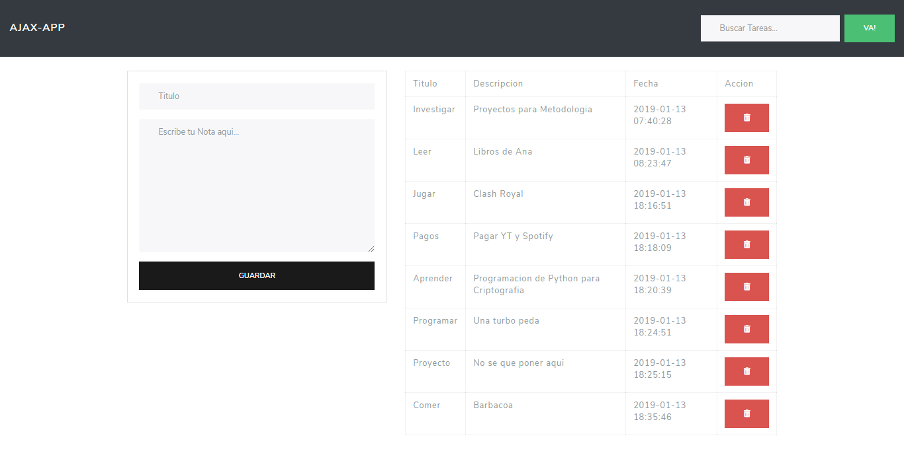

# Task Ajax :sunglasses:
---
## Descripción del sistema

Esta es una aplicacion desarrollada en HTML, JavaScript y PHP para registrar tareas del usuario, se utiliza peticiones ajax para evitar recargar la pagina cada vez que se quiera realizar una de las funcionalidades disponibles.

## Funcionalidades

*TASK:*
---------------
* El usuario puede agregar tareas indicando el titulo y la descripcion de la misma, la aplicacion agregara la fecha y la hora en la que se agrego.
* El usuario puede editar la tarea con un click en el titulo de la tarea, aparecera un panel de edicion.
* El Usuario podra borrar la tarea con el boton de delete que tiene a la derecha de su tarea.
* El usuario tendra una seccion de busqueda donde podra encontrar la tarea que coincida con la busqueda, para saber si ya la ha realizado.
---
## Screenshot 

Mas screenshots disponibles en:
https://imgur.com/gallery/JG5c4Bb
